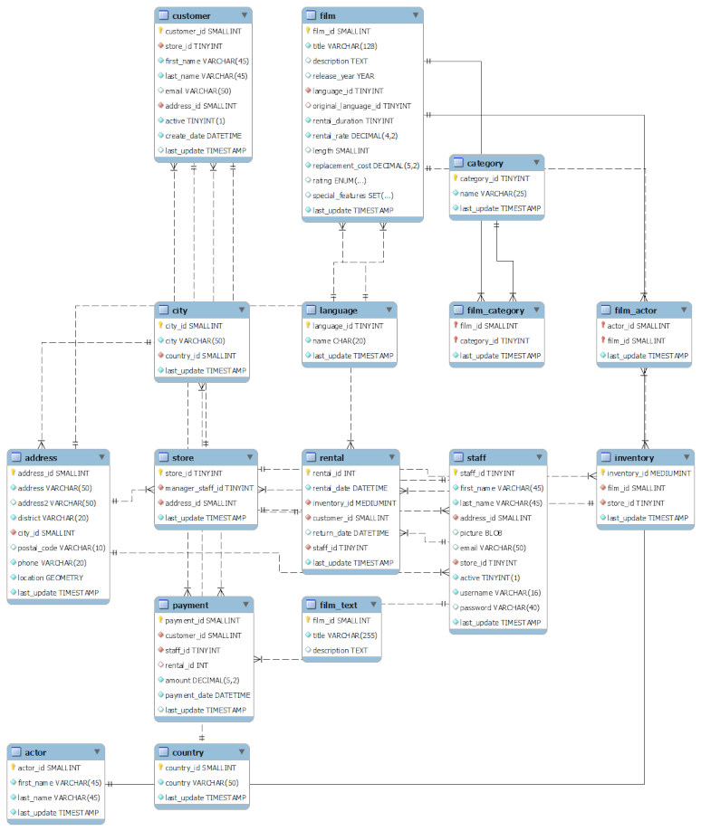

# DVD Rental Store Database Analysis

### Wellington da Silva
### 2022-09-07


## 1 Introduction

In this project I leverage **SQL** with **MySQL** to perform an exploratory data analysis on a DVD rental store database.

The database analyzed here is [Sakila](https://dev.mysql.com/doc/sakila/en/), an example database distributed with MySQL.

### 1.2 The database

Let's first access the database and list its tables:

```sql
USE sakila;
SHOW FULL TABLES;
```

The Sakila database is comprised of the following tables:

|Tables_in_sakila |Description
|--- |---
|actor |Lists information for all actors, such as the first and last names.
|address |Contains address information for customers, staff, and stores, as well as the telephone numbers for the addresses.
|category |Lists the categories that can be assigned to a movie.
|city |Contains the list of the cities in the database.
|country |Contains the list of the countries in the database.
|customer |Contains information of all customers.
|film |Contains information of all movies potentially in stock in the stores.
|film_actor |Relates the actors to the movies they take part in as a many-to-many relationship through foreign keys.
|film_category |Relates movies and categories through foreign keys.
|film_text |Contains the title and description of the movies.
|inventory |Lists the copies of the movies that are in stock in each store.
|language |Lists the possible languages that the movies can have.
|payment |Records each payment made by a customer, with information such as the amount and the rental being paid for (when applicable).
|rental |Contains information on each rental of each inventory item, such as the customer who rented what item, when it was rented, and when it was returned.
|staff |Contains the information of all staff members.
|store |Contains information about all stores in the system, such as the address and who is the manager of the store.

The figure below shows the relations between the tables:



## 2 Analysis

### 2.1 Movies

#### What are the rental rate (the cost to rent the movie) categories and how many movies are there in each one?

```sql
SELECT rental_rate, COUNT(film_id) AS number_of_films 
FROM film
GROUP BY rental_rate;
```

The result of the above query is displayed in the following table:

|rental_rate	|number_of_films
|---    |---
|0.99	|341
|4.99	|336
|2.99	|323

#### Which rating do we have the most movies in?

```sql
SELECT rating, COUNT(film_id) AS number_of_films
FROM film
GROUP BY rating
ORDER BY number_of_films DESC;
```

|rating	|number_of_films
|---    |---
|PG-13	|223
|NC-17	|210
|R	|195
|PG	|194
|G	|178

#### Which rating is most prevalent in each store (considering the total number of film copies)?

```sql
SELECT film.rating, inventory.store_id, COUNT(inventory.inventory_id) AS total_number_of_copies
FROM inventory
LEFT JOIN film
ON inventory.film_id = film.film_id
GROUP BY inventory.store_id, film.rating
ORDER BY total_number_of_copies DESC;
```

|rating	|store_id	|total_number_of_copies
|---	|---	|---
|PG-13	|1	|525
|PG-13	|2	|493
|PG	|2	|480
|NC-17	|2	|479
|NC-17	|1	|465
|R	|2	|462
|PG	|1	|444
|R	|1	|442
|G	|2	|397
|G	|1	|394

#### How many times each movie has been rented out?

The following query will return each unique film Id and how many times it has been rented out.

```sql
SELECT inventory.film_id, COUNT(inventory.film_id) AS number_of_rentals
FROM rental
LEFT JOIN inventory
ON rental.inventory_id=inventory.inventory_id
GROUP BY inventory.film_id
ORDER BY 2 DESC;
```

As there were 958 rows returned, only the top 10 movies with respect to the total number of rentals are displayed here:

|film_id	|number_of_rentals
|---    |---
|103	    |34
|738	   |33
|730	    |32
|382	    |32
|767	    |32
|489	    |32
|331	    |32
|418	    |31
|735	    |31
|1000	|31

#### For each movie, when was the first and the last time it was rented out?

```sql
SELECT inventory.film_id, film.title, MIN(rental.rental_date) AS rented_first_on, MAX(rental.rental_date) AS rented_last_on
FROM inventory
LEFT JOIN rental
ON rental.inventory_id=inventory.inventory_id
LEFT JOIN film
ON film.film_id=inventory.film_id
GROUP BY inventory.film_id;
```

|film_id	|title	|rented_first_on	|rented_last_on
|---	|---	|---	|---
|1	|ACADEMY DINOSAUR	|2005-05-27 07:03:28	|2005-08-23 01:01:01
|2	|ACE GOLDFINGER	|2005-07-07 19:46:51	|2006-02-14 15:16:03
|3	|ADAPTATION HOLES	|2005-05-31 04:50:07	|2005-08-23 13:54:39
|4	|AFFAIR PREJUDICE	|2005-05-27 20:44:36	|2006-02-14 15:16:03
|5	|AFRICAN EGG	|2005-05-28 07:53:38	|2006-02-14 15:16:03
|6	|AGENT TRUMAN	|2005-05-26 15:32:46	|2005-08-21 16:03:01
|7	|AIRPLANE SIERRA	|2005-06-20 21:11:50	|2005-08-22 17:18:05
|8	|AIRPORT POLLOCK	|2005-05-25 19:37:47	|2005-08-23 20:24:36
|9	|ALABAMA DEVIL	|2005-07-06 18:32:49	|2005-08-23 14:26:51
|10	|ALADDIN CALENDAR	|2005-06-15 11:03:24	|2005-08-21 20:49:21

#### Revenue per Movie

```sql
SELECT film.film_id, film.title, SUM(payment.amount) AS total_revenue
FROM payment
LEFT JOIN rental
ON payment.rental_id=rental.rental_id
LEFT JOIN inventory
ON rental.inventory_id=inventory.inventory_id
LEFT JOIN film
ON inventory.film_id=film.film_id
GROUP BY film.film_id
ORDER BY 3 DESC;
```

|film_id	|title	|total_revenue
|---	|---	|---
|879	|TELEGRAPH VOYAGE	|231.73
|973	|WIFE TURN	|223.69
|1000	|ZORRO ARK	|214.69
|369	|GOODFELLAS SALUTE	|209.69
|764	|SATURDAY LAMBS	|204.72
|893	|TITANS JERK	|201.71
|897	|TORQUE BOUND	|198.72
|403	|HARRY IDAHO	|195.70
|460	|INNOCENT USUAL	|191.74
|444	|HUSTLER PARTY	|190.78

### 2.2 Customers

#### What is the last rental date of each customer?

```sql
SELECT customer_id, MAX(rental_date) AS last_rental_date
FROM rental
GROUP BY customer_id;
```

|customer_id	|last_rental_date
|---    |---
|1	|2005-08-22 20:03:46
|2	|2005-08-23 17:39:35
|3	|2005-08-23 07:10:14
|4	|2005-08-23 07:43:00
|5	|2006-02-14 15:16:03
|6	|2005-08-23 06:41:32
|7	|2005-08-21 04:49:48
|8	|2005-08-23 14:31:19
|9	|2006-02-14 15:16:03
|10	|2005-08-22 21:59:29

#### Who are the customers who have rented at least 30 times?

```sql
SELECT rental.customer_id, customer.first_name, customer.last_name, customer.email, COUNT(rental.rental_id) AS rentals_amount
FROM rental
LEFT JOIN customer
ON rental.customer_id=customer.customer_id
GROUP BY rental.customer_id
HAVING rentals_amount >= 30;
```

|customer_id	|first_name	|last_name	|email	|rentals_amount
|---    |---    |---    |---    |---
|1	|MARY	|SMITH	|MARY.SMITH@sakilacustomer.org	|32
|5	|ELIZABETH	|BROWN	|ELIZABETH.BROWN@sakilacustomer.org	|38
|7	|MARIA	|MILLER	|MARIA.MILLER@sakilacustomer.org	|33
|15	|HELEN	|HARRIS	|HELEN.HARRIS@sakilacustomer.org	|32
|20	|SHARON	|ROBINSON	|SHARON.ROBINSON@sakilacustomer.org	|30
|21	|MICHELLE	|CLARK	|MICHELLE.CLARK@sakilacustomer.org	|35
|23	|SARAH	|LEWIS	|SARAH.LEWIS@sakilacustomer.org	|30
|26	|JESSICA	|HALL	|JESSICA.HALL@sakilacustomer.org	|34
|27	|SHIRLEY	|ALLEN	|SHIRLEY.ALLEN@sakilacustomer.org	|31
|28	|CYNTHIA	|YOUNG	|CYNTHIA.YOUNG@sakilacustomer.org	|32

#### Who rented the most?

```sql
SELECT rental.customer_id, customer.first_name, customer.last_name, customer.email, COUNT(rental.rental_id) AS rentals_amount
FROM rental
LEFT JOIN customer
ON rental.customer_id=customer.customer_id
GROUP BY rental.customer_id
ORDER BY rentals_amount DESC
LIMIT 1;
```

|customer_id	|first_name	    |last_name	|email	                            |rentals_amount
|---            |---            |---        |---                                |---
|148	        |ELEANOR	        |HUNT	    |ELEANOR.HUNT@sakilacustomer.org	    |46

#### What is the last rental date of each active customer?

```sql
SELECT customer.customer_id, customer.first_name, customer.last_name, MAX(rental.rental_date) AS last_rental_date
FROM rental
JOIN customer
ON rental.customer_id=customer.customer_id
WHERE rental.customer_id IN (
    SELECT customer.customer_id
    FROM customer
    WHERE customer.active = 1
)
GROUP BY rental.customer_id;
```

|customer_id	|first_name	|last_name	|last_rental_date
|---	|---	|---	|---
|1	|MARY	|SMITH	|2005-08-22 20:03:46
|2	|PATRICIA	|JOHNSON	|2005-08-23 17:39:35
|3	|LINDA	|WILLIAMS	|2005-08-23 07:10:14
|4	|BARBARA	|JONES	|2005-08-23 07:43:00
|5	|ELIZABETH	|BROWN	|2006-02-14 15:16:03
|6	|JENNIFER	|DAVIS	|2005-08-23 06:41:32
|7	|MARIA	|MILLER	|2005-08-21 04:49:48
|8	|SUSAN	|WILSON	|2005-08-23 14:31:19
|9	|MARGARET	|MOORE	|2006-02-14 15:16:03
|10	|DOROTHY	|TAYLOR	|2005-08-22 21:59:29

#### How much each active customer has spent on average?

```sql
SELECT customer.customer_id, customer.first_name, customer.last_name, AVG(payment.amount) AS average_spent
FROM payment
JOIN customer
ON payment.customer_id=customer.customer_id
WHERE payment.customer_id IN (
    SELECT customer.customer_id
    FROM customer
    WHERE customer.active = 1
)
GROUP BY payment.customer_id;
```

|customer_id	|first_name	|last_name	|average_spent
|---	|---	|---	|---
|1	|MARY	|SMITH	|3.708750
|2	|PATRICIA	|JOHNSON	|4.767778
|3	|LINDA	|WILLIAMS	|5.220769
|4	|BARBARA	|JONES	|3.717273
|5	|ELIZABETH	|BROWN	|3.805789
|6	|JENNIFER	|DAVIS	|3.347143
|7	|MARIA	|MILLER	|4.596061
|8	|SUSAN	|WILSON	|3.865000
|9	|MARGARET	|MOORE	|3.903043
|10	|DOROTHY	|TAYLOR	|3.990000

### 2.3 Monthly analysis

#### Rentals per month

```sql
SELECT EXTRACT(MONTH FROM rental_date) AS month, COUNT(rental_id) AS rentals
FROM rental
GROUP BY month
ORDER BY month;
```

|month	|rentals
|--- |---
|2	|182
|5	|1156
|6	|2311
|7	|6709
|8	|5686

#### Revenue Per Month

```sql
SELECT EXTRACT(MONTH FROM payment_date) AS month, SUM(amount) AS revenue
FROM payment
GROUP BY month
ORDER BY month;
```

|month	|revenue
|--- |---
|2	|514.18
|5	|4824.43
|6	|9631.88
|7	|28373.89
|8	|24072.13